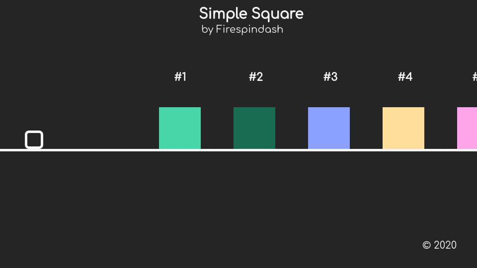

# SimpleSquareGame

It is a simple game inspired by an Android game called _Gravity Box_ by _Luca1152_. Yet another project which involves _NPM_ packages. 
## Disclaimer
I made it with _GDevelop_ in the version 5.0.0-beta. It is a game engine that lets you create games easier with _Javascript_, I have no afiliation with it and I actually would not recommend using it, because of things like _Node.js_ being used, which has worser performance than _Deno_ by design, and because of the dependency mess. 
